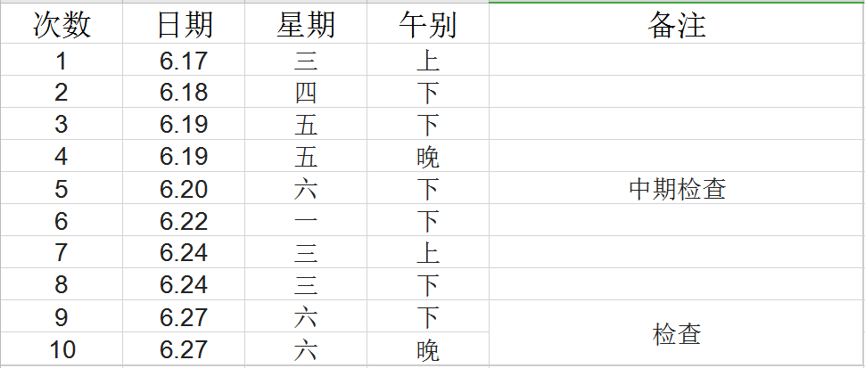

## 目录
- [一、课设目标](#一课设目标) 
- [二、课设要求](#二课设要求)
- [三、课设安排](#三课设安排)
- [四、课设内容](#四课设内容)
- [五、参考资料](#五参考资料)
- [六、问题讨论](#六问题讨论)

## 一、课设目标
遥感图像处理是遥感科学与技术专业的专业基础课，其核心内容是若干遥感图像处理算法和原理。本课程设计的主要目标培养学生既懂遥感图像处理算法理论，也懂遥感图像处理算法实现的专业素养和动手能力的专业人才，其具体目标为：
1. 强化学生对遥感图像处理算法原理的**理解**
2. 培养学生解决遥感应用问题的**设计能力**
3. 培养学生遥感图像处理算法的**编程能力**
4. 培养学生**交流沟通和书面表达能力**

[**返回目录**](#目录)
---

## 二、课设要求
### 1. 基本要求
1. 独立完成课设的内容，意味着你不能直接使用第三方的源码；
2. 程序语言原则上使用C/C++，若你有更为擅长的语言，也可以使用C#、Python等；
3. 无论你使用哪种程序语言，都需要讲核心算法从底层实现起，这意味着你不得直接调用第三方库（如ENVI-IDL、OpenCV、Egien、Matlab等）已经封装的函数；
4. 课设的每一个算法，要有算法基本原理的讲解、算法实现的流程图、程序接口设计说明、源代码、算法处理的测试结果（与主流遥感图像处理软件对应功能结果对比）。
5. 编码需符合编码规范。工程文件的命名、组织、函数的命名、变量的命名必须为英文，简洁而明晰，并添加适当注释以确保程序的可读性。
6. 课程设计结束后**1 周内**，依照[**课设报告模板**](./contents/%E8%AF%BE%E8%AE%BE%E6%8A%A5%E5%91%8A.docx)撰写课设报告。
7. 课设报告中尽量避免引用大段的代码，保留界面截图和运行结果即可。
8. 提交纸质课设报告一份，课设报告和代码工程的电子档各一份，以班级为单位刻盘上交。

### 2.课程考核
1. 课设成绩由4部分如下表：

|序号|必做题|选做题（N选2）|报告|
|:-:|:-:|:-:|:-:|:-:|
|分值比重|60%|30%|10%|
|及格|√|×|√|
|中等|√|X|√|
|良好|√|√1|√|
|优秀|√|√2|√|

2. 课设报告必须要封面、格式统一
3. 无论源代码或报告内容出现抄袭，一律零分处理

[**返回目录**](#目录)
---

## 三、课设安排

[**返回目录**](#目录)
---

## 四、课设内容
本次课程的重点是图像处理算法，因此对GUI不做过多的要求，即控制台程序和GUI界面程序均可。但课设的所有算法，要能够组织到一起，需要在一个可执行程序下调用。当然我们更希望看到美观的GUI界面程序。课设内容包括以下功能：
### 0. 准备工作
#### [0.开发环境配置](./contents/D0_EnvSetup.md)
配置VS2017、Qt5、GDAL的文档。

#### [1.程序框架构建](./contents/D1_RSIP_Frame.md)
掌握Qt、MFC或其他界面框架，构建基本的系统原型，包括视图、菜单、工具栏等界面要素。

### 1. 必做题 - 50%
#### 基本统计
- 功能1：**统计量计算**
- 描述：**输入图像，计算图像的中值、均值、众数、方差、相关系数等统计值**
- 函数名：**Statistics**

---

- 功能2：**散点图计算**
- 描述：**输入图像，生成选取波段组合的散点图**
- 函数名：**ScatterPlot**

#### PCA Transformation
- 功能：主成分变换
- 描述：输入图像、输出PCA变化结果及中间矩阵
- 函数名：Pca
- 备注：最好能实现逆PCA变换

---

#### 傅立叶变换
- 功能： 傅立叶正逆变换
- 描述：输入图像、输出傅立叶变换后图像；输入傅立叶变换后图像，输出逆变换图像；
- 函数名：Fft

---

#### 影像分割
- 功能： 影像分割
- 描述：输入图像、输出分割后图像
- 函数名：Segmentation
- 备注：区域增长法或者OTSU法

---

#### 非监督分类
- 功能： 非监督分类
- 描述：输入图像、输出分类后图像
- 函数名：Classfication
- 备注：ISODATA分类

---

[**返回目录**](#目录)
---

### 2. 附加题 - 40% Challenges（选做其中2个）
#### 1. 图像显示与增强（必做题）
- 需求
       选取遥感图像数据，进行图像显示，并可实现反差增强和直方图增强等三种以上的显示增强方式。
- 功能分析
	- 遥感影像显示
	- 影像反差增强
	- 影像直方图增强
考核要点：图像显示效率
---

#### 2. 几何校正
- 需求
	遥感图像自动配准程序。输入两幅图像，提取特征点，完成特征点的匹配，计算校正参数，完成图像重采样，实现几何校正。
- 功能分析
	-  特征点提取：SIFT 或 其他算子
	- 特征点匹配：RANSAC匹配方法
	- 几何校正参数计算：参数计算
	- 图像重采样：几何校正
-考核要点：匹配效率、控制点匹配精度
---

#### 3. 土地利用分类
- 需求
  输入多光谱图像，完成土地利用分类功能，包括：统计分类、神经网络分类方法各一种、分类后处理、分类精度评价。
- 功能分析
  - ROI选取
  - ROI评价
  - 两种以上分类算法（至少统计分类、神经网络分类方法各一种）
  - 分类后处理
  - 分类精度评价

---

#### 4. 图像质量评价
- 需求
  对输入的遥感图像进行定量的质量评价，并实现一种图像质量恢复方法。
- 功能分析
  - 量化图像质量评价
  - 图像质量恢复

---

#### 5. 多尺度分割与面向对象分类
- 需求
  对输入遥感图像进行多尺度分割，并能实现基本的面向对象分类方法。
- 功能分析
  - 多尺度图像分割
  - 基于分割对象实现一种分类算法

---

[**返回目录**](#目录)
---

## 五、参考资料
### 1. 开源库
- [Qt入门](https://blog.csdn.net/Louis_815/article/details/54286544)
- [GDAL](www.gdal.org)
- [OpenCV](www.opencv.org)
- [CImg](www.cimg.eu)
- [CxImage](https://www.codeproject.com/Articles/1300/CxImage)
- [Eigen](<http://eigen.tuxfamily.org/index.php?title=Main_Page>)
- Eigen的配置和安装，请参考<<https://blog.csdn.net/abcjennifer/article/details/7781936>>。
- Eigen的使用，可以参考<<https://zhuanlan.zhihu.com/p/31111908>>。

---

### 2.功能参考
- [遥感图像数据I/O](./contents/D2_RasterIO.md)
	要求实现常用遥感图像数据（GeoTiff，IMG，Pix，jpeg，bmp、Envi）的读、写操作，读取并显示遥感图像的基本信息及统计信息。

- [遥感图像的显示](./contents/D3_ImageDisplay.md)
	要求实现遥感图像的灰度显示、彩色合成显示、具备放大、缩小、屏幕适应的显示方式，具备线性拉伸、均衡化等增强显示方式。

- [遥感影像预处理](./contents/D4_Preprocess.md)
	要求实现图像滤波、PCA分析、影像融合等功能。

- [遥感影像几何校正](./contents/D5_Geocorrection.md)
	实现但不限于多项式校正的几何校正方法，包括：控制点选取（读取）、几何校正模型计算、重采样内插等功能。

- [遥感影像分类](./contents/D6_Classification.md)
	实现监督分类和非监督分类的算法至少各一种。

- [遥感图像处理过程](https://blog.csdn.net/liminlu0314/article/details/8757262)

---

### 3. 程序架构示意图

[**返回目录**](#目录)
---
